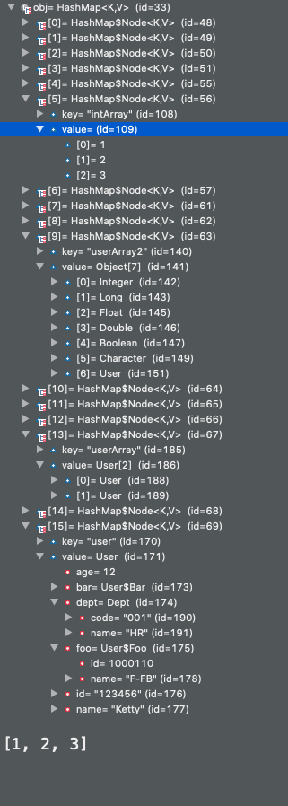

# Test


Run main class `JsonTest2`

  

```json
{
  "Boolean": {
    "className": "java.lang.Boolean",
    "object": true,
    "primitive": false,
    "type": 1
  },
  "Byte": {
    "className": "java.lang.Byte",
    "object": 11,
    "primitive": false,
    "type": 1
  },
  "Float": {
    "className": "java.lang.Float",
    "object": 123.456,
    "primitive": false,
    "type": 1
  },
  "Fouble": {
    "className": "java.lang.Double",
    "object": 123.456,
    "primitive": false,
    "type": 1
  },
  "Int": {
    "className": "java.lang.Integer",
    "object": 123,
    "primitive": false,
    "type": 1
  },
  "Long": {
    "className": "java.lang.Long",
    "object": 123,
    "primitive": false,
    "type": 1
  },
  "booleanArray": {
    "componentType": "boolean",
    "elementTypes": [],
    "object": [
      false,
      true,
      false
    ],
    "primitive": false,
    "type": 2
  },
  "floatArray": {
    "componentType": "float",
    "elementTypes": [],
    "object": [
      1.1,
      2.2,
      3.3
    ],
    "primitive": false,
    "type": 2
  },
  "intArray": {
    "componentType": "int",
    "elementTypes": [],
    "object": [
      1,
      2,
      3
    ],
    "primitive": false,
    "type": 2
  },
  "list": {
    "componentType": null,
    "elementTypes": [
      "java.lang.String",
      "java.lang.String",
      "java.lang.String"
    ],
    "object": [
      "Java",
      "Python",
      "Go"
    ],
    "primitive": false,
    "type": 3
  },
  "list2": {
    "componentType": null,
    "elementTypes": [
      "java.lang.Integer",
      "java.lang.Long",
      "java.lang.Double",
      "java.lang.Boolean"
    ],
    "object": [
      123,
      9223372036854775807,
      123.0,
      true
    ],
    "primitive": false,
    "type": 3
  },
  "set": {
    "componentType": null,
    "elementTypes": [
      "java.lang.String",
      "java.lang.String",
      "java.lang.String"
    ],
    "object": [
      "Java",
      "Go",
      "Python"
    ],
    "primitive": false,
    "type": 4
  },
  "user": {
    "className": "org.os.maven.ketty.User",
    "object": {
      "age": 12,
      "bar": {
        "id": 2000110,
        "name": "B-FB"
      },
      "dept": {
        "code": "001",
        "name": "HR"
      },
      "foo": {
        "id": 1000110,
        "name": "F-FB"
      },
      "id": "123456",
      "name": "Ketty"
    },
    "primitive": false,
    "type": 1
  },
  "userArray": {
    "componentType": "org.os.maven.ketty.User",
    "elementTypes": [
      "org.os.maven.ketty.User",
      "org.os.maven.ketty.User"
    ],
    "object": [
      {
        "age": 12,
        "bar": null,
        "dept": {
          "code": "001",
          "name": "HR"
        },
        "foo": null,
        "id": "123456",
        "name": "Ketty"
      },
      {
        "age": 22,
        "bar": null,
        "dept": {
          "code": "008",
          "name": "HR"
        },
        "foo": null,
        "id": "123457",
        "name": "Jack"
      }
    ],
    "primitive": false,
    "type": 2
  },
  "userArray2": {
    "componentType": "java.lang.Object",
    "elementTypes": [
      "java.lang.Integer",
      "java.lang.Long",
      "java.lang.Float",
      "java.lang.Double",
      "java.lang.Boolean",
      "java.lang.Character",
      "org.os.maven.ketty.User"
    ],
    "object": [
      1,
      2,
      3.4,
      4.5,
      true,
      "￿",
      {
        "age": 12,
        "bar": null,
        "dept": {
          "code": "001",
          "name": "HR"
        },
        "foo": null,
        "id": "123456",
        "name": "Ketty"
      }
    ],
    "primitive": false,
    "type": 2
  },
  "userList": {
    "componentType": null,
    "elementTypes": [
      "org.os.maven.ketty.User",
      "org.os.maven.ketty.User"
    ],
    "object": [
      {
        "age": 12,
        "bar": null,
        "dept": {
          "code": "001",
          "name": "HR"
        },
        "foo": null,
        "id": "123456",
        "name": "Ketty"
      },
      {
        "age": 22,
        "bar": null,
        "dept": {
          "code": "008",
          "name": "HR"
        },
        "foo": null,
        "id": "123457",
        "name": "Jack"
      }
    ],
    "primitive": false,
    "type": 3
  }
}
```


  

